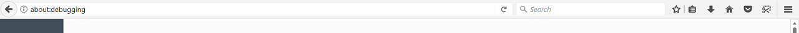
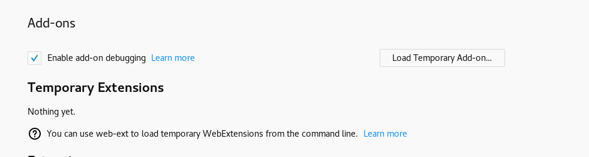
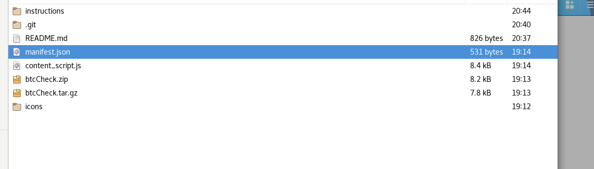

# btcCheck

Webextension to check bitcoin price on the page itself by just clicking on small icon next to the bitcoin address,
no need to go to blockchain website to check value of that address.

Thanks to this youtube series to get an idea about [webextensions](https://www.youtube.com/watch?v=WrEgBDg56sM&list=PLI08QU9qtPEJiBs7rVOT4FvXJlisDgTlS)

Steps to install locally:

1. Download the zip file and extract the files.
2. In Firefox's address bar type 'about:debugging' and hit enter.

3. Click on 'Load Temporary Add On' button.

4. Navigate through your files to find the folder where you have extracted the files and double click on the 'manifest.json' file.

5. btcCheck should now be installed

Enjoy :wink
